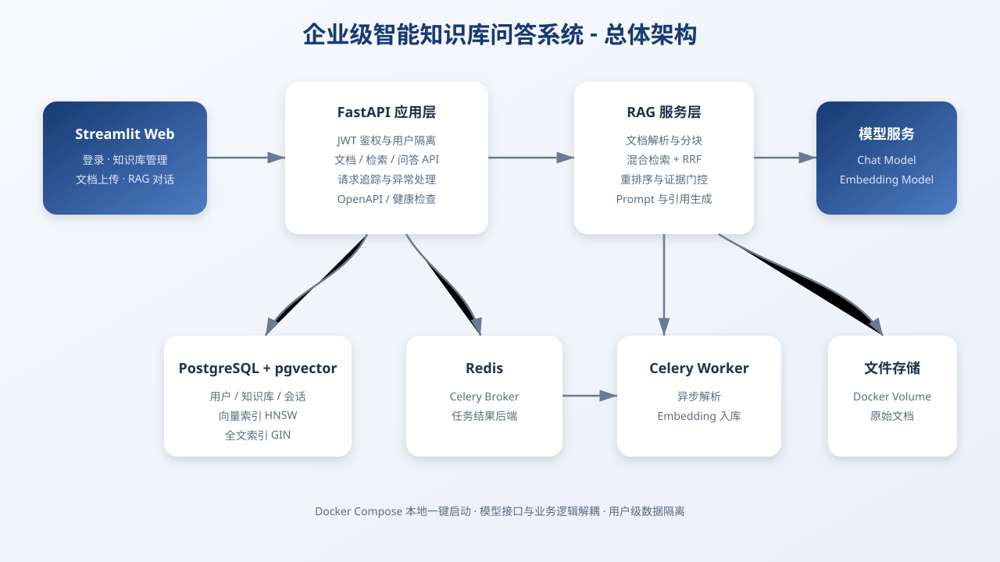
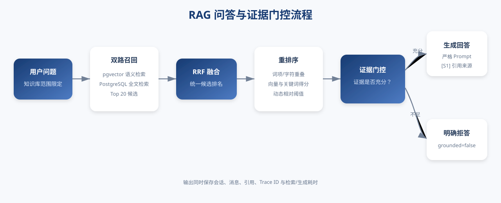

# 企业级智能知识库问答系统

一个面向企业内部员工的可解释 RAG 知识库问答项目，重点展示 Python 后端、文档处理、混合检索、大模型应用、异步任务、自动评测和 Docker 部署能力。



## 核心能力

- **账号与权限**：注册、登录、JWT 鉴权，用户级知识库和文档隔离。
- **文档入库**：支持 PDF、DOCX、Markdown、TXT，使用 Celery + Redis 异步解析。
- **数据处理**：文本清洗、重叠分块、批量 Embedding、任务状态和失败原因记录。
- **混合检索**：pgvector HNSW 向量检索 + PostgreSQL GIN 全文检索 + RRF 融合。
- **证据重排序**：综合词项/字符重叠、向量分数和关键词分数，过滤弱相关来源。
- **严格 RAG**：只基于知识库回答，返回 `[S1]` 引用，证据不足时明确拒答。
- **会话持久化**：保存会话、消息、引用、Trace ID、检索与生成耗时。
- **量化评测**：自动计算 Hit@5、Recall@5、MRR@5、引用准确率和拒答通过率。
- **可观测性**：结构化日志、请求 ID、健康检查、统一内部错误响应和安全响应头。
- **容器部署**：FastAPI、Streamlit、PostgreSQL/pgvector、Redis、Celery 一键启动。

## 技术栈

| 层级 | 技术 |
|---|---|
| Web UI | Streamlit |
| API | FastAPI、Pydantic v2 |
| 数据访问 | SQLAlchemy 2.x、asyncpg |
| 数据库 | PostgreSQL 16、pgvector |
| 异步任务 | Celery、Redis |
| 文档解析 | PyMuPDF、python-docx |
| 模型接口 | OpenAI-compatible Chat / Embedding API |
| 检索 | Vector Search、PostgreSQL FTS、RRF |
| 测试 | pytest、pytest-asyncio、HTTPX |
| 部署 | Docker Desktop、Docker Compose |

## 快速启动

### 1. 进入项目目录

```powershell
Set-Location "D:\项目\项目5"
```

### 2. 准备环境变量

首次运行：

```powershell
Copy-Item .env.example .env
```

不要覆盖已经配置好的 `.env`，并且不要提交真实 API Key。

对话模型和 Embedding 模型可以使用不同的接口与凭证：

```env
LLM_BASE_URL=
LLM_API_KEY=
LLM_MODEL=

EMBEDDING_BASE_URL=
EMBEDDING_API_KEY=
EMBEDDING_MODEL=
EMBEDDING_DIMENSIONS=1024
```

`EMBEDDING_DIMENSIONS` 必须与模型真实输出维度一致。

### 3. 构建镜像

项目路径包含中文，使用提供的构建脚本：

```powershell
powershell -ExecutionPolicy Bypass -File .\scripts\build-image.ps1
```

### 4. 启动服务

```powershell
docker compose up -d
docker compose ps
```

### 5. 访问

| 服务 | 地址 |
|---|---|
| Streamlit | http://localhost:8501 |
| Swagger | http://localhost:8000/docs |
| ReDoc | http://localhost:8000/redoc |
| Liveness | http://localhost:8000/api/v1/health/live |
| Readiness | http://localhost:8000/api/v1/health/ready |

## RAG 流程



```text
上传文档
  -> Celery 异步解析
  -> 文本清洗与分块
  -> Embedding 与全文索引
  -> 向量检索 + 全文检索
  -> RRF 融合
  -> 重排序与证据门控
  -> LLM 生成或明确拒答
  -> 返回引用并保存会话
```

## 运行测试

普通测试：

```powershell
docker exec kb-api pytest -q
```

包含 PostgreSQL 的全量集成测试：

```powershell
docker exec -e RUN_DB_TESTS=1 kb-api pytest -q
```

当前验收结果：

```text
17 passed
```

PyMuPDF 可能产生 SWIG 弃用警告，不影响当前功能。

## 运行评测

首次执行会重建专用演示知识库并导入 6 份脱敏制度文档：

```powershell
docker exec kb-api python scripts/evaluate_rag.py
```

复用现有演示知识库：

```powershell
docker exec kb-api python scripts/evaluate_rag.py --skip-prepare
```

2026-08-30 自建演示集结果：

| 指标 | 结果 |
|---|---:|
| Retrieval Hit@5 | 100.00% |
| Retrieval Recall@5 | 100.00% |
| MRR@5 | 1.0000 |
| 引用准确率 | 100.00% |
| 引用覆盖率 | 100.00% |
| 关键答案词覆盖率 | 100.00% |
| 知识库外问题拒答通过率 | 100.00% |
| 平均检索与重排序耗时 | 430.58 ms |

> 指标仅代表项目自行编写的 6 份制度文档和 30 条标准问题，不代表所有真实企业数据上的通用准确率。

## 项目结构

```text
app/
  api/           FastAPI 路由
  core/          配置、安全、日志、中间件
  db/            SQLAlchemy 模型和初始化
  evaluation/    评测指标
  llm/           Chat/Embedding 适配层和 Prompt
  parsers/       文档解析与分块
  retrieval/     向量、全文、RRF 和重排序
  services/      RAG 业务编排
  tasks/         Celery 文档任务
frontend/        Streamlit 界面
scripts/         构建、演示数据和评测脚本
data/seed/       可公开的虚构脱敏制度文档
data/evaluation/ 标准问题集和最新评测报告
docs/            架构、部署、API、面试和安全文档
tests/           单元测试与集成测试
```

## 文档导航

- [系统架构](docs/architecture.md)
- [部署说明](docs/deployment.md)
- [API 使用示例](docs/api-usage.md)
- [RAG 评测方案](docs/evaluation.md)
- [安全说明](docs/security.md)
- [常见问题排查](docs/troubleshooting.md)
- [项目演示脚本](docs/demo-script.md)
- [简历项目描述](docs/resume-description.md)
- [面试讲解与追问](docs/interview-guide.md)
- [最终验收清单](docs/acceptance-checklist.md)

## 安全提醒

- `.env`、上传文件和真实密钥不会提交到 Git。
- 不要在截图、日志、README、Issue 或聊天中展示完整 API Key。
- 如果密钥曾意外暴露，应立即在供应商控制台撤销并重新生成。
- 生产部署必须使用 HTTPS、强 JWT 密钥、强数据库密码、限流和备份。

## 当前边界

- 扫描版 PDF 暂未接入 OCR。
- 当前重排序为可解释规则，后续可接入独立 Reranker 模型。
- 权限目前是用户所有权隔离，尚未实现企业组织、部门角色和 ACL。
- 文件存储使用 Docker Volume，生产环境建议迁移到对象存储。
- 当前评测数据为作品集演示数据，真实业务需要持续扩充测试集。

## 停止服务

```powershell
docker compose down
```

不要使用 `docker compose down -v`，除非明确要删除数据库和 Redis 数据卷。
